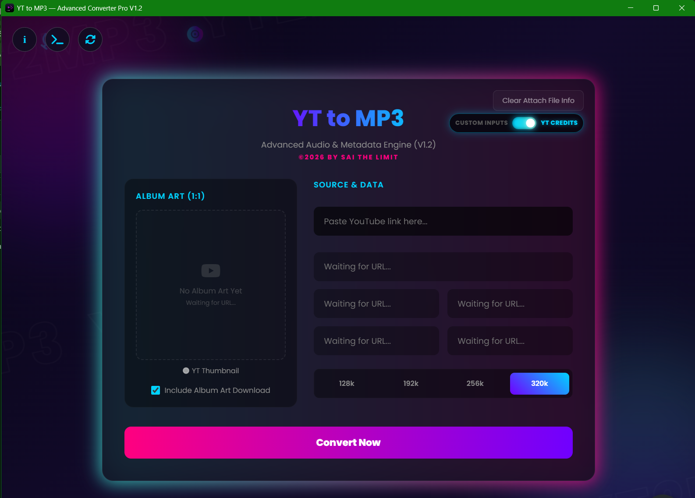

# 🚀 YT to MP3 — Advanced Audio & Metadata Engine (V1.2)

A sleek, high-performance, full-stack application designed for seamless YouTube audio extraction and advanced ID3 metadata tagging. Ships in two forms from the same codebase: a **Electron desktop app** and a **local web app + Node.js server**. Built with a responsive neon cyber-themed UI.

---

## ✨ Features

- **High-Fidelity Extraction:** Extract high-quality audio files directly from YouTube links with selectable bitrates up to **320kbps**.
- **Automated ID3 Tagging:** Dynamically injects track title, artist name, album, release year, and genre details straight into the generated `.mp3` container.
- **Smart 1:1 Album Art Cropper:** Upload custom cover artwork and crop it with an interactive overlay — and YouTube thumbnails are now auto center-cropped to a true square so there's no letterboxing in players.
- **Resilient Progress Tracking:** Download and encode progress bars reflect real backend state end-to-end and always land on 100% when a conversion finishes, in both the desktop app and the web/server engine.
- **Connection-Aware:** Detects no internet connection before and during a conversion, and shows a "slow connection, please wait" notice if progress stalls — in both the desktop app and the web version.
- **Resilient Local Server Connection (Web Version):** The web client retries connecting to `server.js` for up to ~25 seconds and tolerates brief dropped status polls, instead of failing the moment the script is still starting up.
- **Sys-Terminal Logger Matrix:** View real-time conversion metrics, chunk processing ratios, and underlying operations inside a beautiful integrated Matrix terminal drawer.
- **Wipe Data Cache Protection:** The "Clear Attach File Info" feature clears local inputs instantly, decoupling active configuration memory before processing single streams.
- **Persistent Local Preferences:** Remembers structural inputs (Artist, Album, Genre, Bitrate selections) using secure client-side database schemas for fast workflow returns.

---

## 🛠️ Tech Stack & Architecture

- **Frontend:** HTML5, CSS3 (custom `@keyframes` layouts, floating audio nodes), native JavaScript (ES6+), IndexedDB, Canvas API (Matrix rain simulation + square album-art cropping), [Cropper.js](https://cdnjs.com/libraries/cropperjs) for image manipulation.
- **Desktop Shell:** Electron — the same `index.html` runs inside an Electron `BrowserWindow` with Node integration, calling `youtube-dl-exec` and `node-id3` directly with no local server required.
- **Backend (Web Version):** Node.js, [Express](https://expressjs.com/), CORS middleware layer, UUID task tracking.
- **Core Processing Engine:** [youtube-dl-exec](https://github.com/microlinkhq/youtube-dl-exec) wrapper utilizing optimized underlying binaries (`yt-dlp`), and [node-id3](https://github.com/Zazama/node-id3) for binary audio frame modifications.

---

## ⚙️ Installation & Setup

Ensure you have [Node.js](https://nodejs.org/) installed on your machine before commencing initialization.

### 1. Clone the Repository

```bash
git clone https://github.com/sfmuhammmad327-wq/YT2MP3-V1.0.git
cd YT2MP3-V1.0
```

### 2. Install Project Dependencies

Run the command below within your project directory to provision the mandatory modules:

```bash
npm install
```

If you're setting the project up from scratch without a `package.json`, install the core modules directly:

```bash
npm install express cors uuid youtube-dl-exec node-id3 electron --save
```

### 3. Ensure System-Level Binaries Are Configured

Because the core uses `youtube-dl-exec` under the hood, make sure your deployment environment has valid media formats available (`ffmpeg`) and allows execution permission for the bundled `yt-dlp` binary.

---

### Option A — Run the Desktop App (Electron)

No local server needed — the app talks to `yt-dlp`/`ffmpeg` directly from the Electron process.

```bash
npm start
```

To build a distributable installer (e.g. `.exe` / `.dmg`):

```bash
npm run build
```

The packaged installer will be written to your build output folder (e.g. `dist/`).

### Option B — Run the Web Version (Browser + Local Server)

**1. Boot up the conversion engine backend:**

```bash
node server.js
```

The console will display:

```
Advanced Converter Engine Backend is ONLINE
Listening on: http://127.0.0.1:5000
Waiting for tasks from Web Client...
```

**2. Launch the client interface:**

Open `index.html` directly inside any modern web browser (or host it via local static serving) while `server.js` keeps running in the background. The page will automatically retry connecting to the local server if it's still starting up.

---

## 📂 Project Structure

```
├── server.js          # Core Express web server & stream execution pipelines (web version)
├── index.html          # Interactive cyber-neon UI & state machinery (web + Electron renderer)
├── main.js             # Electron main process entry point (desktop app)
├── package.json         # Project metadata, dependencies & build scripts
├── Saiffuddin.png      # Developer profile avatar reference asset
├── yt2mp3.ico           # Application tab/desktop brand favicon identifier
└── temp/                # Auto-generated runtime storage directory (git-ignored)
```

---

## 🆕 What's New in V1.2

- Progress bars (download + encoding) now reliably reach 100% on completion in both the desktop app and the web version — no more bars stuck just under complete.
- Back button now sits next to the web version's Setup Info button for a cleaner top-left layout.
- YouTube thumbnail album art is now center-cropped to a true 1:1 square before embedding, removing blank letterbox bars in players.
- Added connection awareness: a clear "no internet connection" notice before/during conversion, and a "slow connection, please wait" nudge if progress stalls — for both the desktop app and the web version.
- Web version now retries connecting to `server.js` for longer and tolerates brief dropped status checks, instead of failing immediately if the server is still starting up.

---

## 🔒 License & Disclaimer

This engine is created solely for personal media aggregation, localized caching, and educational testing frameworks. Please ensure you possess the legitimate authorization or downloading permission for any intellectual properties fetched via external references.

## 👑 Credit

Designed and developed with absolute passion by:

**Muhammad Saiffuddin Bin Ahmad Fauzi** — Known as *Sai the Limited*

🚀 High-Tier Competitive Strategy & Graphics Systems Engineer

📧 Inquiries: sfmuhammmad327@gmail.com

🌐 GitHub Profile: [@sfmuhammmad327-wq](https://github.com/sfmuhammmad327-wq)

© 2026 BY SAI THE LIMIT. All Rights Reserved.
